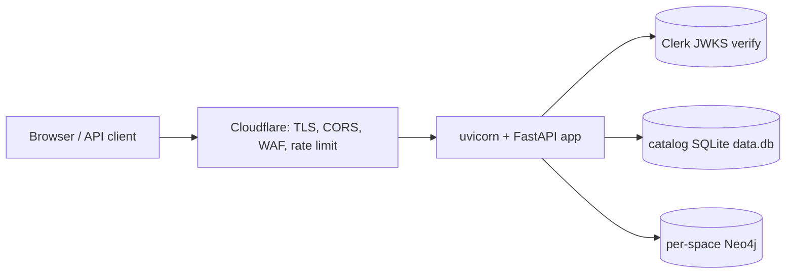

# Deployment & Operations

pona flow is delivered as a **dedicated single-tenant instance** per client (see
[DECISIONS.md](DECISIONS.md)). Each instance runs the FastAPI/ASGI app behind Cloudflare,
authenticates users via Clerk, and owns its own Neo4j + SQLite data.

**End-user onboarding (non-technical):** share [GETTING-STARTED.md](GETTING-STARTED.md) with
customers who only need to sign in and use the product — this document is for operators.

**Local developer machine (clone + venv + Neo4j + UI):** see
[FIRST-TIME-SETUP.md](FIRST-TIME-SETUP.md).




## 1. Runtime

```bash
python3 -m venv .venv && source .venv/bin/activate
pip install -r requirements.txt        # fastapi, uvicorn, pyjwt[crypto], httpx, neo4j

# Start the server (binds FORM_BRIDGE_HOST/PORT, default 127.0.0.1:8765):
python Engine/dev_server.py
```

**Local dev:** use `python Engine/dev_server.py` (above). It loads `.env`, prints the UI URLs,
and runs uvicorn from the activated venv — you do not need to invoke `uvicorn` yourself.

**If you run uvicorn directly**, activate the venv first (otherwise you get `command not found`):

```bash
source .venv/bin/activate   # Windows: .venv\Scripts\activate
uvicorn server.app:app --host 127.0.0.1 --port 8765 --app-dir Engine
```

Or call the venv binary without activating:

```bash
.venv/bin/uvicorn server.app:app --host 127.0.0.1 --port 8765 --app-dir Engine
```

For production, run uvicorn under a process manager (systemd, a container entrypoint, etc.)
and bind to the private interface that Cloudflare reaches:

```bash
uvicorn server.app:app --host 127.0.0.1 --port 8765 --app-dir Engine
# scale with --workers N once the workload warrants it
```

Build the UI before serving (the app serves `App/ui/dist`):

```bash
cd App/ui && npm install && npm run build
```

## 2. Edge: Cloudflare (TLS / CORS / rate limiting)

The application **does not** terminate TLS or set CORS headers — Cloudflare owns these
(DECISIONS.md D3):

- Put the instance hostname behind Cloudflare with TLS (Full/Strict).
- Restrict the origin so only Cloudflare can reach the app port (Cloudflare Tunnel or an
IP allowlist / firewall on the private network). Never expose `:8765` publicly.
- Configure CORS at the edge to allow only the instance's own UI origin.
- Enable a WAF rule / rate limit on `/api/`* (Clerk and the app verify identity, but edge
rate limiting protects against abuse and brute force).

## 3. Authentication: Clerk

Each instance has its own Clerk application (or a Clerk org/instance dedicated to the
client). Required configuration:


| Variable                     | Where                        | Purpose                                             |
| ---------------------------- | ---------------------------- | --------------------------------------------------- |
| `CLERK_ISSUER`               | server env                   | Clerk Frontend API URL; JWKS URL is derived from it |
| `CLERK_JWKS_URL`             | server env (optional)        | Explicit JWKS URL (overrides issuer derivation)     |
| `CLERK_AUTHORIZED_PARTIES`   | server env (optional)        | Comma-separated allowed `azp` origins               |
| `VITE_CLERK_PUBLISHABLE_KEY` | UI build env (`App/ui/.env`) | Clerk publishable key for the React app             |


The backend verifies the session JWT signature against Clerk's JWKS and maps the Clerk
`sub` to a local `users` row. **Bootstrap:** the first user to authenticate on a fresh
instance becomes the instance admin. Provision the instance by having the client's
designated owner sign in first.

## 4. Secrets & data

- Neo4j and SQLite connection values are referenced indirectly: `spaces` rows store the
**names** of environment variables, never the secrets. Inject the actual values
(`NEO4J_URI`, `NEO4J_PASSWORD`, per-space `*_NEO4J_`*, `SQLITE_DATABASE_PATH`, etc.)
via the host's secret store / environment. Do **not** commit a production `.env`.
- The catalog database (`data.db`) holds `spaces`, `queries`, `state`, `users`,
`space_members`, and `regex`. Back it up alongside the per-space SQLite files and Neo4j.
- **User-managed credentials** (Credentials tab) follow the same indirection: the catalog
`space_credentials` table stores only metadata (name, env key, description) — never the
value. The value backend is selected by `PONA_FLOW_CREDENTIAL_BACKEND`
(`passthrough` default = read-only `os.environ`; `local` = read/write `.env`; `hosted` =
reserved). Keep production on `passthrough` and inject credential values via the platform
under the per-credential env key (`<SPACE_ID>_CRED_<NAME>`) shown in the UI; do **not** set
`local` in production (it would write the container's `.env`). Workflows reference a
credential as `$secret.<NAME>`, resolved at request time and never persisted or logged.
- See [.env.example](../.env.example) for the full variable list.

## 5. Migrations

Catalog schema is applied deterministically at startup by
`[Engine/server/migrations.py](../Engine/server/migrations.py)` (idempotent
`CREATE ... IF NOT EXISTS`). No manual migration step is needed for catalog tables on
deploy/upgrade; per-space `entities` tables migrate on first space access.

## 6. Sequence endpoint-step safety (SSRF)

Sequence "endpoint" steps make outbound HTTP calls. By default the server blocks
private/loopback/link-local/reserved targets. Tighten further per instance:

- `PONA_FLOW_OUTBOUND_ALLOWLIST` — comma-separated host allowlist (recommended in prod).
- `PONA_FLOW_ALLOW_PRIVATE_OUTBOUND=1` — only for trusted self-hosted callbacks; leave off otherwise.

## 7. Admin surface

`/api/db/`* (the raw catalog table editor, including the static
`App/data-db-editor.html`) is restricted to **instance admins**. The static editor page
does not send a Clerk token, so it will be rejected in production; use it only via an
authenticated admin context, or keep it for local development.

## 8. Single-tenant provisioning checklist

1. Provision host + private network; install Python deps and build the UI.
2. Create the client's Clerk application; set `CLERK_ISSUER` (server) and
  `VITE_CLERK_PUBLISHABLE_KEY` (UI build).
3. Inject Neo4j / SQLite secrets via the host environment.
4. Put the instance behind Cloudflare (TLS, origin lock, CORS, rate limit).
5. Start the server; have the client owner sign in first (becomes instance admin).
6. Owner creates spaces (creator becomes space owner) and adds members.

