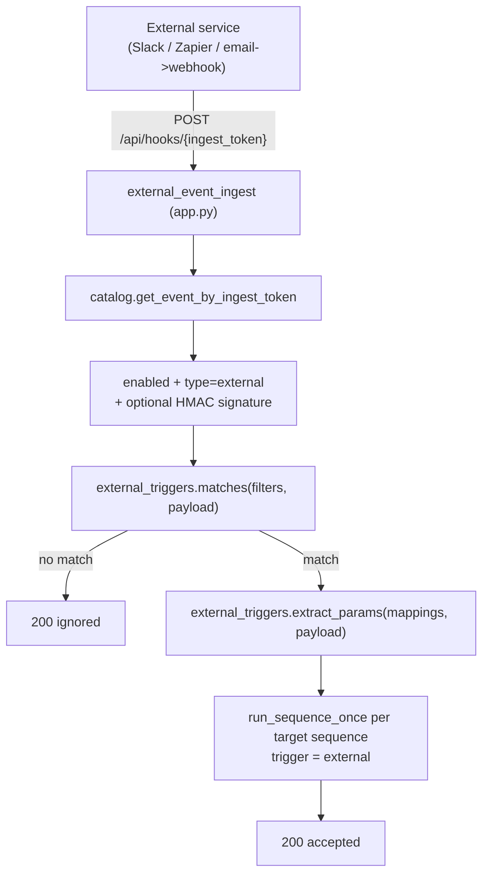

# External Event Triggers — Developer Guide

This guide is for **developers** wiring an external system (Slack, Zapier, an email->webhook
gateway, a CI pipeline, ...) to trigger a pona flow sequence when something happens *outside*
the instance — receiving a message, an email, a deploy, etc.

For the architectural rationale, see [DECISIONS.md](DECISIONS.md) (D10). For triggering a
specific sequence directly as an authenticated agent, see
[SEQUENCE-WEBHOOKS.md](SEQUENCE-WEBHOOKS.md) instead.

> **One-sentence version:** An event of type `external` gives you a single inbound URL —
> `POST /api/hooks/{ingest_token}` — that any service can POST a JSON payload to; the event
> matches the payload against your filters, maps payload fields into sequence parameters, and
> runs the selected sequences.

---

## 1. How it fits together



This is the **payload-side analogue** of time-bound events: where a time event declares
*when* to run (rule tree in `server.triggers`), an external event declares *what inbound
payload* runs it (`server.external_triggers`). Both fire the same sequences through the same
execution engine.

---

## 2. Setup (in the UI)

External events are created in the **Events** panel like time events:

1. Create an event and set **Trigger type** to **External event (inbound webhook)**.
2. **Save once.** The instance mints the event's **Inbound URL** on first save; copy it from
   the builder (it does not change on later saves).
3. Optionally set a **Signing secret** (see [Security](#5-security)).
4. Add **Match filters** (optional) and **Payload to parameter mappings** (optional).
5. Select the **Sequences to run** when a matching payload arrives.

Point your external service at the Inbound URL.

---

## 3. The inbound request

```bash
curl -X POST "$BASE/api/hooks/$INGEST_TOKEN" \
  -H "Content-Type: application/json" \
  -d '{ "event": { "type": "message", "user": "U123", "text": "deploy please" } }'
```

The body is any JSON value (object or array). Non-JSON bodies are tolerated and exposed to
filters/mappings as `{ "raw": "<text>" }`.

Responses (always `200` unless auth/lookup fails):

| Body | Meaning |
|------|---------|
| `{ "status": "accepted", "ran": [...], "failed": [...] }` | Payload matched; listed sequences were dispatched. |
| `{ "status": "ignored" }` | Payload did not match the filters; nothing ran. |

Error statuses follow the instance-wide `{ "error": "..." }` contract:

| Status | Cause |
|--------|-------|
| `404` | Unknown ingest token (or the event is not an external event). |
| `403` | The event is disabled. |
| `401` | A signing secret is set and the signature is missing/invalid. |

The handler is deliberately defensive: a malformed payload never returns `500` and never
disables your hook.

---

## 4. Filters and parameter mappings

Both filters and mappings address the payload with a **dot/bracket JSON path**:
`event.type`, `items[0].id`, `items.0.id`. A missing key resolves to nothing (filters fail
closed; mappings are skipped).

### Filters (decide whether to fire)

Each filter is `{ path, operator, value }`. With no filters, **every** request fires the
event. Filters are combined with the event's `combinator` (`AND` default, or `OR`).

| Operator | Fires when |
|----------|------------|
| `equals` | the value at `path` equals `value` (string compare) |
| `contains` | `value` is a substring of the value at `path` |
| `exists` | `path` resolves to a non-null value (`value` ignored) |
| `regex` | the value at `path` matches the regex in `value` |

### Mappings (build the sequence parameters)

Each mapping is `{ source_path, parameter }`: the value at `source_path` is placed into the
sequence parameter `parameter`. Mapped values are layered over the event's fixed
`parameters`; a mapping that resolves to nothing falls back to the fixed value (and then to
the sequence step's own default).

Because external runs are **non-interactive** (like the scheduler), a required parameter with
no mapped/fixed value falls back to the step default rather than pausing.

---

## 5. Security

- **The URL is the secret.** The ingest token is high-entropy and minted server-side; treat
  the Inbound URL as a credential.
- **Optional HMAC signature.** Set a **Signing secret** to require integrity-verified calls.
  The caller must send `X-Pona-Signature: <hex>` where `<hex>` is `HMAC-SHA256(secret, raw
  body)`. A `sha256=` prefix (GitHub/Slack style) is tolerated. Comparison is constant-time.

  ```bash
  SIG=$(printf '%s' "$BODY" | openssl dgst -sha256 -hmac "$SECRET" | awk '{print $2}')
  curl -X POST "$BASE/api/hooks/$INGEST_TOKEN" \
    -H "Content-Type: application/json" \
    -H "X-Pona-Signature: $SIG" \
    -d "$BODY"
  ```

- **Edge protections apply.** In production Cloudflare still fronts the instance for TLS and
  rate limiting (see [DECISIONS.md](DECISIONS.md) D3).
- **Outbound steps are still guarded.** Sequences that call external URLs go through the same
  SSRF controls regardless of how the run was triggered (D7).

---

## 6. Relationship to the other trigger paths

| Mechanism | Entry point | Auth | Params source | `audit_log.trigger` |
|-----------|-------------|------|---------------|---------------------|
| **External event** | `POST /api/hooks/{ingest_token}` | URL token + optional HMAC | payload mappings + fixed | `external` |
| Time event | in-process scheduler | none (system) | event package `parameters` | `event` / `recovery` |
| Agent webhook | `POST /api/spaces/{space}/sequences/{seq}/run` | agent key / Clerk | request `params` | `webhook` |
| MCP tool call | `POST /api/spaces/{space}/mcp` | agent key / Clerk | tool arguments | `mcp` |

Use an **external event** when an outside system should fire one or more sequences on a
matching payload. Use the **agent webhook / MCP** when an authenticated agent wants to call a
specific sequence directly with known parameters.
