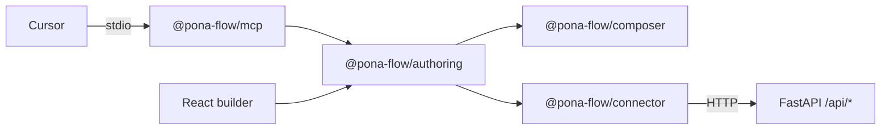
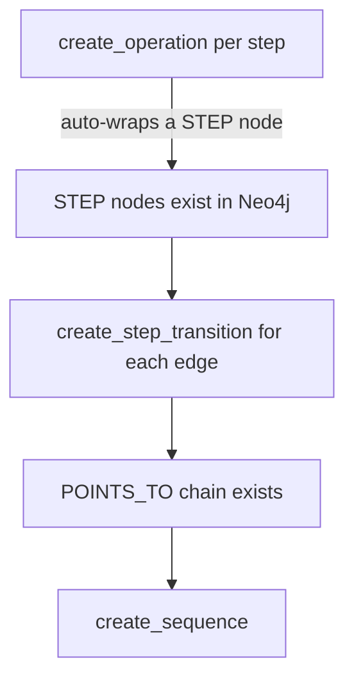

# MCP Authoring Gateway — Developer Guide

This guide covers the **authoring** MCP server: a local Node process that exposes pona flow's
configuration surface — SCHEMAs, INSTANCEs, STEP nodes, transitions, and sequences — as tools
an agent in Cursor can call in natural language.

It is a different thing from the gateway in [MCP-GATEWAY.md](MCP-GATEWAY.md). That one serves
a space's sequences as **runnable** tools. This one serves the surface that **creates** them.
The two are complementary and can be connected at the same time.

> **One-sentence version:** Run `npm start` in `App/mcp`, point Cursor at it, and say
> "create a customer schema with a unique email, then a sequence that logs a shipment and
> notifies the customer" — the agent builds it, and everything it builds opens in the visual
> builder like anything a human made.

---

## 1. Why this is a separate Node server

The obvious implementation — model "create a STEP" as a sequence and expose it through the
existing gateway — does not work, for three independent reasons:

- **Sequence steps run Cypher only.** `_execute_query_step` in
  [Engine/server/execution_run.py](../Engine/server/execution_run.py) reads
  `referenced.get("cypher")` and never a `sqlite` array; `EXECUTION-package.schema.json` has
  no `sqlite` field at all. STEP and SCHEMA definitions live in the per-space SQLite
  `entities.payload`, so a meta-operation running as a step would write nothing.
- **A run cannot write the catalog, deliberately.** `_is_queries_catalog_upsert_sql` in
  [Engine/server/catalog.py](../Engine/server/catalog.py) strips queries-table upserts out of
  stored `queries.sqlite`.
- **Composition is TypeScript.** `@pona-flow/composer` turns a QueryObject into Cypher, and
  there is no Python equivalent.

A Node process calling `POST /api/execute-create` sidesteps all three: that endpoint does run
SQLite (`packages._run_sqlite_list`), and a Node process imports the composer directly.



The important edge is the one from the React builder: **both clients call the same authoring
package**. Validation, naming rules, and the save choreography are defined once, so an
agent-authored operation and a human-authored operation are the same artifact.

---

## 2. Setup

```bash
cd pona-flow/App/mcp
npm install
```

Then add the server to Cursor's `mcp.json` (`~/.cursor/mcp.json`, or `.cursor/mcp.json` in a
project):

```json
{
  "mcpServers": {
    "pona-flow-authoring": {
      "command": "/absolute/path/to/pona-flow/App/mcp/run-mcp.sh"
    }
  }
}
```

On macOS, Cursor launched from the Dock often has no nvm `PATH` and may ignore `cwd`,
so the package ships `App/mcp/run-mcp.sh`: it `cd`s into the package, uses an absolute
Node binary, and starts `tsx`. Prefer that over a bare `npx tsx …` entry.

| Variable | Required | Meaning |
|---|---|---|
| `PONA_FLOW_API_BASE` | no | Engine base URL. Defaults to `http://127.0.0.1:8765`. |
| `PONA_FLOW_SPACE_ID` | no | Default space. Without it every tool call must pass `space_id`. |
| `PONA_FLOW_KEY` | yes* | Agent key, sent as `X-Pona-Flow-Key`. Mint one in the space's **Agents** tab. |
| `PONA_FLOW_DISABLE_AUTH` | no | Set to `1` to allow an empty key against a local dev server. |

\*Required unless `PONA_FLOW_DISABLE_AUTH=1`. For local `npm start`, these may live in the
engine root `pona-flow/.env` (the same file the Python server reads) — the MCP process
loads that file when a variable is not already set in the shell or Cursor `mcp.json`.

The transport is **stdio** — Cursor launches the process and speaks MCP over its pipes. The
server writes nothing to stdout except protocol frames; diagnostics go to stderr.

**Permissions.** The agent key's role decides what it can do, the same as any other client.
Authoring specifically requires `create STEP` flow permission, enforced server-side on
`/api/queries/upsert` and `/api/execute-create` — an agent key that cannot author operations
gets a `403` rather than a partially applied change.

---

## 3. Build order

This is the one piece of sequencing the agent cannot infer from the tool schemas, so it is
also stated in the server's `instructions` string.



A sequence's read Cypher matches STEP nodes **by attributive_label at run time**, and a
transition attaches to STEP nodes **by graph id**. Both need their nodes to already exist.
Saving an operation is what brings a STEP node into being — every save auto-wraps one — which
fixes the order: operations, then transitions, then the sequence.

Getting it wrong fails quietly rather than loudly: a sequence created before its steps exist
matches nothing and runs as a no-op.

---

## 4. Tool reference

### Introspection (read-only)

| Tool | Returns |
|---|---|
| `list_spaces` | Every space id and name. Start here when no default is configured. |
| `describe_space` | Connections, registered attributive labels, navigation groups. |
| `list_operations` | Saved catalog packages, filterable by `kind`. |
| `get_operation` | One package in full, including its `builder_config` snapshot. |
| `describe_sequence` | A sequence's package plus the STEP chain its Cypher traverses. |
| `list_step_nodes` | Every STEP node, what it wraps, and its outgoing `POINTS_TO` edges. |
| `list_schemas` | Every SCHEMA node. |
| `describe_schema` | A SCHEMA's property constraints and its edges to other SCHEMAs. |

`describe_space` matters more than it looks: attributive labels are **globally unique across
STEP and SCHEMA** within a space, so it is how the agent avoids proposing a name that is
already taken.

### Authoring

| Tool | Effect |
|---|---|
| `create_operation` | Saves a package to the catalog, auto-wraps it in a STEP node, and (by default) a one-step sequence. The visual builder always wraps; agents can pass `add_as_sequence=false`. `execute=true` also runs it. |
| `update_operation` | Recompiles and overwrites a package in place. The catalog name always saves and is shared with the paired one-step sequence title; the wrap STEP label follows only when the name is free and no multi-step sequence MATCHES the current wrap. Returns `wrap_retargeted` / `wrap_label`. |
| `create_step_transition` | Writes a `POINTS_TO` edge between two existing STEP nodes, optionally conditional. |
| `create_sequence` | Saves a runnable sequence starting at an existing STEP node. |
| `update_sequence` | Overwrites a sequence in place (title, entry step, traversal, parameters, description). The wrap STEP label follows a new title only when that name is free in the graph. A one-step sequence title and its wrapped operation name are the same value — renaming either writes both. |

**Intent arguments, not raw QueryObjects.** A QueryObject nests clause → pattern → path →
node → property → schematic properties, with interdependent fields. Asking a model to emit
one correctly in a single shot is the least reliable part of this surface, so the tools take
small flat arguments (`node_label`, `attributive_label`, `schema_properties`, `where`, …) and
the server assembles the nesting. Every tool also accepts a raw `query` argument as an escape
hatch for shapes the flat arguments cannot express, such as multi-hop paths — the output of
`get_operation` is a valid example to start from.

**Naming is normalized, not rejected.** Attributive labels and property keys are UPPER_SNAKE.
An agent writing `email address` gets `EMAIL_ADDRESS` rather than a validation error, which
mirrors the builder rewriting the field as you type. Operation names use the same UPPER_SNAKE
form. On create, the wrapping STEP takes the resolved name, with a numeric suffix if it
collides. On update, the catalog title always saves and stays in lockstep with the paired
one-step sequence title; the wrap label follows only when that name is free and no multi-step
sequence MATCHES the current wrap.

**Saving is not running.** A create package *describes* nodes; it materializes them only when
it runs. Pass `execute=true` to `create_operation` when the SCHEMA or INSTANCE should exist
immediately. `create_step_transition` always writes immediately — an edge is not a reusable
package.

### Destructive (two-phase)

| Tool | Cascade |
|---|---|
| `delete_step` | The STEP node, its edges, the operation it wraps, and every sequence through it. |
| `delete_schema` | The SCHEMA, its instances, and the operations bound to it. |
| `delete_operation` | A sequence unlinks from the nav. An operation deletes its wrap STEP and one-step sequence; multi-step sequences that MATCH that STEP are suspended, not deleted. |

Each refuses to write on its first call. It returns the `/preview` blast radius and a
`confirm_token`; only a second call carrying that token performs the deletion. Tokens are
bound to the exact action and target and expire after ten minutes, so one cannot be replayed
against a different label.

### Repair

`repair_step_wraps` finds operations whose wrapping STEP node was left half-written. Saving an
operation touches the catalog database, the per-space SQLite mirror, and Neo4j with no
transaction spanning them, so an interrupted save can leave a graph node with no entity row —
the operation looks saved but cannot run. The tool reports what it finds; `apply=true` re-runs
the wrap for each.

---

## 5. What makes agent-authored artifacts editable

A saved package's Cypher is forward-only — the composer has no decompiler. The builder reopens
an operation from the `builder_config` snapshot stored alongside it in the catalog. Because the
MCP server saves through the same `@pona-flow/authoring` functions the builder uses, it writes
the same snapshot, so anything an agent creates can be opened, inspected, and edited visually.

`tests/mcp-authoring-roundtrip.mjs` is the test that pins this down: it creates an operation
through the real MCP tools, fetches it back, and asserts the stored snapshot recomposes to
byte-identical Cypher and parameters.

One cosmetic gap: `matchPositions` is canvas layout and is empty on agent-created operations.
The match canvas auto-lays-out via `App/ui/src/utils/graphLayout.ts`, so they open tidy anyway.

---

## 6. Verification

Run from `App/ui`:

```bash
npm run typecheck:mcp        # tsc over App/mcp
npm run typecheck:authoring  # tsc over App/authoring
npm run test:authoring       # tests/authoring-parity.mjs
npm run test:mcp             # tool schemas + the round-trip
```

- **`tests/authoring-parity.mjs`** — a golden AuthoringContext still composes to pinned
  cypher / sqlite / parameters, and `services/execute.ts` re-exports the identical function
  objects from the authoring package instead of keeping a divergent copy.
- **`tests/mcp-authoring-tools.mjs`** — the tool schemas build, bad arguments are rejected,
  intent output passes validation and composes to the expected Cypher, and confirmation
  tokens are single-use and target-bound. No engine required.
- **`tests/mcp-authoring-roundtrip.mjs`** — the full choreography against an in-memory engine,
  ending in the recompose assertion described above.

And on the Python side, `.venv/bin/python tests/authoring-server-gates.py` covers the two
server-side gates: the ownership-aware attributive-label uniqueness check (a re-save of your
own label passes, someone else's does not) and the `create STEP` requirement on
`/api/queries/upsert`.

---

## 7. The two MCP surfaces side by side

| | Authoring gateway (this doc) | Runtime gateway ([MCP-GATEWAY.md](MCP-GATEWAY.md)) |
|---|---|---|
| Implementation | Node, `App/mcp` | Python, `Engine/server/mcp_gateway.py` |
| Transport | stdio (local process) | Streamable HTTP, per space |
| Tools | Fixed authoring verbs | The space's runnable sequences |
| Purpose | Configure the engine | Run what was configured |
| Decision record | D11 | D9 |

A natural loop: author a sequence with this server, then call it through the runtime gateway.
