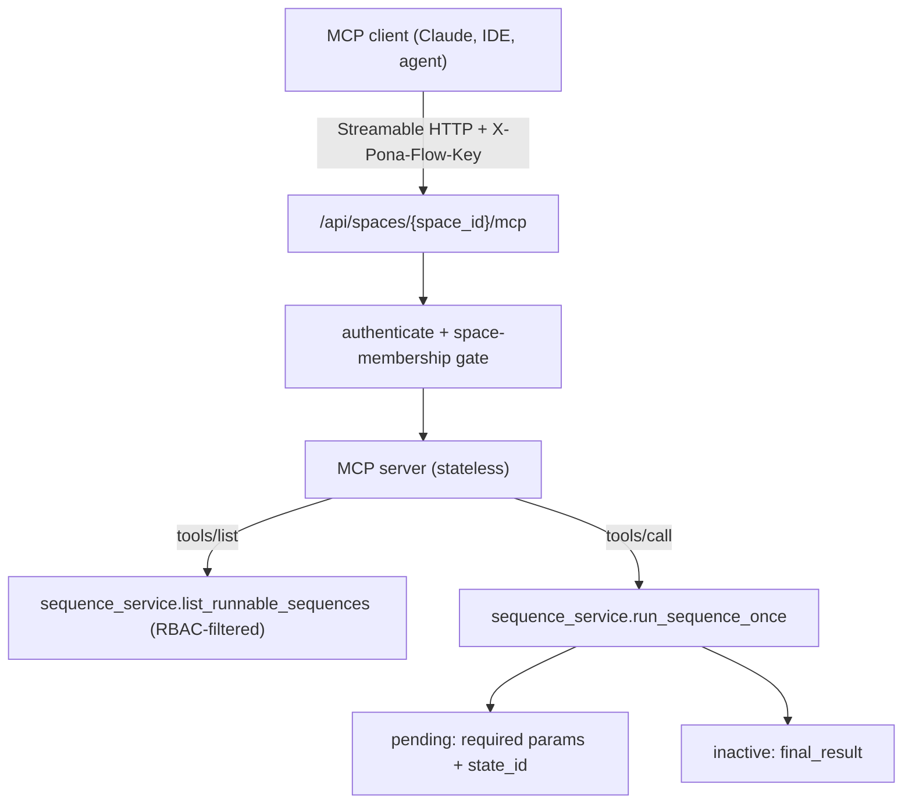
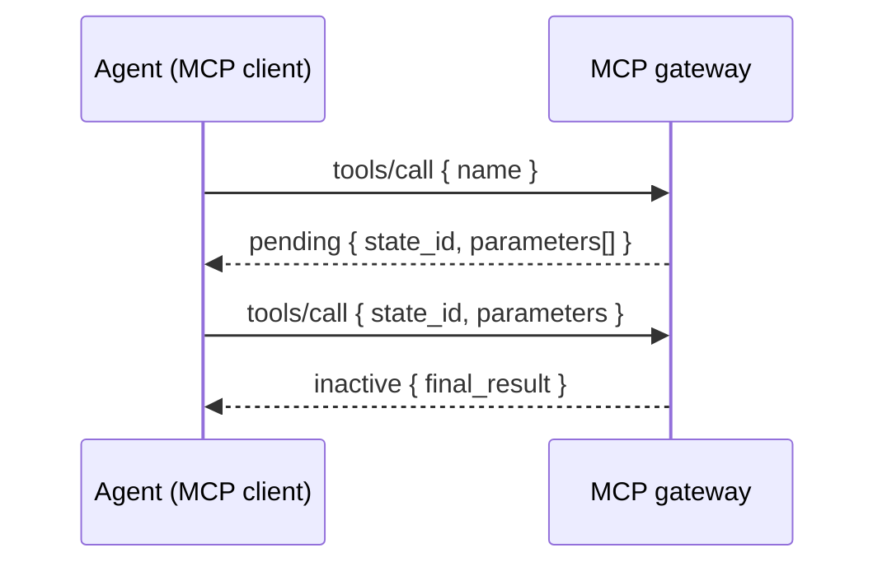

# MCP Gateway — Developer Guide

This guide is for **developers** connecting AI agents and MCP-compatible clients (Claude
Desktop, IDE assistants, custom agents) to pona flow. It explains how each space is served
as a **Model Context Protocol (MCP) server** whose **tools are that space's sequences**.

It builds directly on the webhook layer — see [SEQUENCE-WEBHOOKS.md](SEQUENCE-WEBHOOKS.md)
for the underlying run/resume contract — and on the architecture decision in
[DECISIONS.md](DECISIONS.md) (D9).

> **One-sentence version:** Point an MCP client at `https://<host>/api/spaces/{space_id}/mcp`
> with an agent API key, and the space's runnable sequences appear as callable tools — each
> returning either a final result or the parameters it still needs (human-in-the-loop).

For the companion server that *creates* those sequences rather than running them, see
[MCP-AUTHORING.md](MCP-AUTHORING.md) (D11).

---

## 1. How it works



- **Transport:** the official MCP **Streamable HTTP** transport in **stateless** mode. Each
  request is independent (no session affinity), so it scales across instances and works
  cleanly behind Cloudflare.
- **One server per space:** the endpoint is mounted per space at
  `/api/spaces/{space_id}/mcp`. A client configured with a space's key talks only to that
  space.
- **Tools are sequences:** every triggerable sequence the caller may run is exposed as a
  tool. The tool `name` is the sequence id; its `title` is the human name.
- **Descriptions guide the agent:** if a sequence has a description (set when creating it
  in the builder), it becomes the tool `description`; otherwise a generic line is used. A
  parameter's description (set per-parameter in the builder) leads its `inputSchema`
  property description, with the required/format hint appended. The **space** description
  (Space → Settings) becomes the server's `instructions` — overall guidance the client
  reads before listing tools.
- **Thin wrapper:** the gateway adds no new domain logic — `tools/list` and `tools/call`
  delegate to the same `sequence_service` primitives the webhook uses
  ([Engine/server/mcp_gateway.py](../Engine/server/mcp_gateway.py)).

---

## 2. Authentication

Identical to the webhook: an agent API key (preferred for agents) or a Clerk JWT.

```http
X-Pona-Flow-Key: stg_...
```

or

```http
Authorization: Bearer stg_...
```

Mint and manage keys in the space settings **Agents** tab, or via the API (see
[SEQUENCE-WEBHOOKS.md](SEQUENCE-WEBHOOKS.md) section 2). An agent key is scoped to a single
space, and the agent's role decides which sequences appear as tools and which it may call.
Requesting a space the key does not belong to returns `403`.

---

## 3. Connecting a client

Most MCP clients accept a Streamable HTTP URL plus custom headers. Configuration shape:

```json
{
  "mcpServers": {
    "pona-flow-marketing": {
      "url": "https://your-instance.example/api/spaces/MARKETING/mcp",
      "headers": { "X-Pona-Flow-Key": "stg_...your-token..." }
    }
  }
}
```

Replace `MARKETING` with your space id (the normalized, uppercase space name) and use your
own host. Locally, that is `http://127.0.0.1:8765/api/spaces/<SPACE>/mcp` (or port `5173`
through the Vite dev proxy).

---

## 4. The protocol calls

The gateway is a standard MCP server, so any compliant client drives it. The raw JSON-RPC
(useful for debugging with `curl`) looks like this.

### tools/list

```bash
curl -X POST "http://127.0.0.1:8765/api/spaces/MARKETING/mcp" \
  -H "X-Pona-Flow-Key: stg_..." \
  -H "Content-Type: application/json" \
  -H "Accept: application/json, text/event-stream" \
  -d '{ "jsonrpc": "2.0", "id": 1, "method": "tools/list", "params": {} }'
```

Each tool's `inputSchema` lists the sequence's parameters (all optional — see HITL below)
plus a `state_id` argument used to resume a paused run.

### tools/call

```bash
curl -X POST "http://127.0.0.1:8765/api/spaces/MARKETING/mcp" \
  -H "X-Pona-Flow-Key: stg_..." \
  -H "Content-Type: application/json" \
  -H "Accept: application/json, text/event-stream" \
  -d '{
    "jsonrpc": "2.0",
    "id": 2,
    "method": "tools/call",
    "params": {
      "name": "ID_bc13b4c5893a4aa3927b1d59eb4123c2",
      "arguments": { "name": "mitchie" }
    }
  }'
```

The tool result is a text content block containing the executor's JSON response.

---

## 5. Human-in-the-loop (pending parameters)

Sequences resolve required inputs lazily. When a step needs input the caller has not yet
supplied, the tool result is the executor's `pending` payload:

```json
{
  "status": "pending",
  "state_id": "ID_e9154d2d...",
  "step_id": "ID_e6a4550a...",
  "parameters": [{ "name": "name", "is_required": true, "value_type": "string" }],
  "resolved": {}
}
```

To continue, the agent calls the **same tool again**, passing the requested parameter(s)
**and** the `state_id` from the pending result:

```json
{
  "method": "tools/call",
  "params": {
    "name": "ID_bc13b4c5...",
    "arguments": { "state_id": "ID_e9154d2d...", "name": "mitchie" }
  }
}
```



Repeat until `status` is `inactive` (done) or `error`. This works with every MCP client
because it needs only ordinary tool calls — no elicitation support is required.

---

## 6. Local development & enabling/disabling

The gateway is mounted automatically when the `mcp` package is installed (it is in
[requirements.txt](../requirements.txt)). Just run the server:

```bash
pip install -r requirements.txt
python Engine/dev_server.py
```

- **Disable the gateway:** uninstall `mcp` (`pip uninstall mcp`). The mount and lifespan
  hooks become no-ops and the rest of the API is unaffected (`mcp_gateway.MCP_AVAILABLE`
  is `False`).
- **Diagnostic test:** `\.venv/bin/python tests/mcp-gateway-smoke.py` exercises the schema
  build, RBAC tool filtering, and run delegation without a live server.

---

## 7. Transport security

By default the SDK's DNS-rebinding / Host-header validation is **disabled**: in production
Cloudflare validates the Host and terminates TLS (see [DECISIONS.md](DECISIONS.md) D3), and
the agent key is the real authorization gate. To enable strict Host validation in front of
the gateway, set a comma-separated allowlist:

```bash
PONA_FLOW_MCP_ALLOWED_HOSTS="your-instance.example,api.your-instance.example"
```

Outbound sequence steps still pass through the same SSRF controls (D7) regardless of who
triggered the run.

---

## 8. How tools map to sequences

| MCP concept | pona flow concept |
|-------------|--------------------|
| MCP server (one per space) | Space |
| Tool | Triggerable sequence the caller may run |
| Tool `name` | Sequence id (e.g. `ID_...`) |
| Tool `title` | Sequence name |
| Tool `description` | Sequence description (falls back to name + group) |
| Tool `inputSchema` | Aggregated sequence parameters (each carrying its description) + `state_id` |
| Server `instructions` | Space description |
| `pending` result + `state_id` | Human-in-the-loop pause / resume |
| Agent key + RBAC allowlist | Tool authorization |

Because the gateway wraps `sequence_service`, anything that improves sequence execution
(new step types, branching, response bindings) is exposed through MCP automatically.
