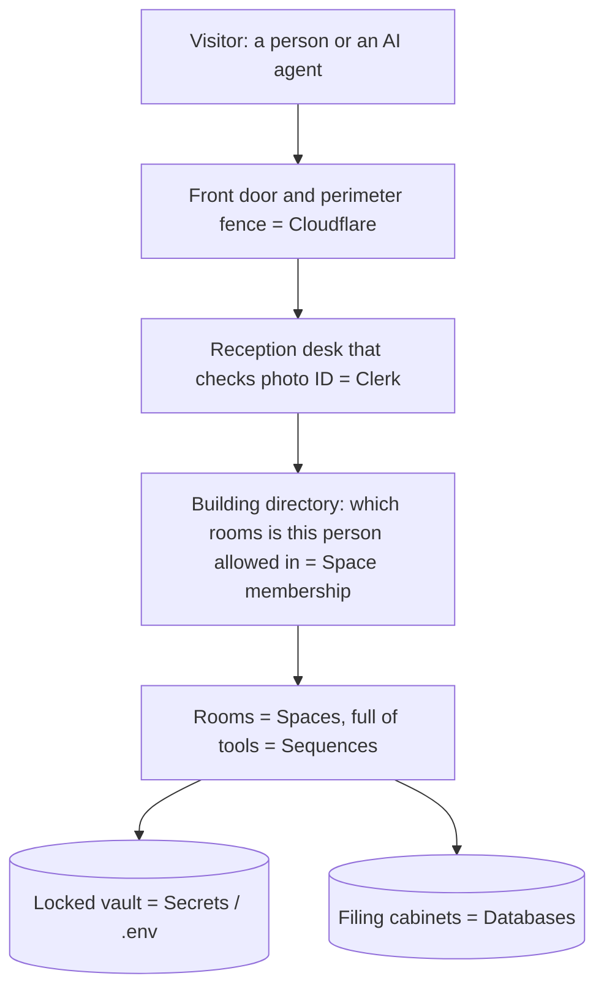
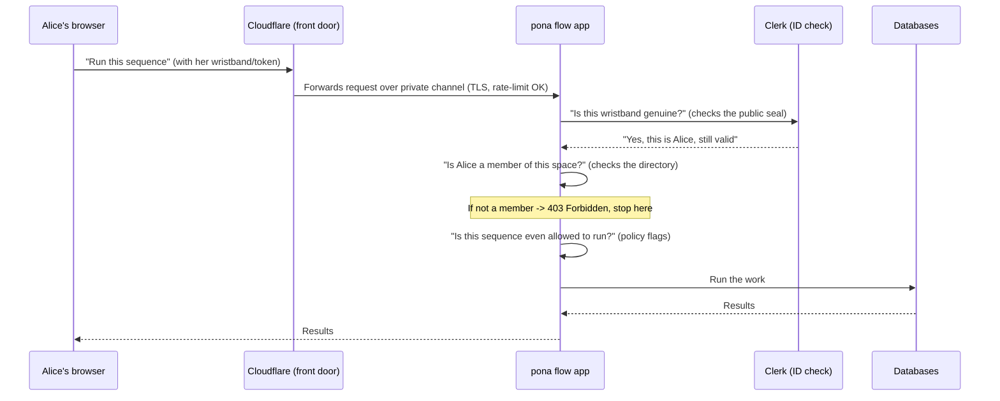

# pona flow Security & Architecture — A Plain-English Guide

This document explains, in everyday language, how pona flow is secured and how the
pieces fit together. It's written for someone launching their first product, so it leans
on analogies and examples. For the terse, technical versions, see
[DECISIONS.md](DECISIONS.md) and [DEPLOYMENT.md](DEPLOYMENT.md). For step-by-step user
onboarding, see [GETTING-STARTED.md](GETTING-STARTED.md).

> **The one-sentence version:** We turned an app that anyone on your laptop could fully
> control into a building with a locked front door (Cloudflare), a professional reception
> desk that checks ID (Clerk), key-card access to individual rooms (space membership),
> and a vault for the keys (secret management) — so each customer gets their own private,
> safe copy.

---

## 1. The big picture: a building with security

Imagine pona flow as an **office building** that each customer owns a private copy of.

Each layer does one job. If one layer fails, the others still protect you. Security people
call this **"defense in depth"** — like having both a building fence *and* locked office
doors, not relying on just one.

| Building part | Real technology | What it does |
|---------------|-----------------|--------------|
| Perimeter fence + front door | **Cloudflare** | Encrypts traffic, blocks floods of malicious requests |
| Reception desk checking ID | **Clerk** | Confirms *who* a visitor is (login) |
| Building access directory | **Space membership** | Decides *which rooms* a confirmed visitor may enter |
| Rooms | **Spaces** | Isolated working environments |
| Tools in each room | **Sequences** | The actions/automations that can be run |
| The vault | **Secrets / `.env`** | Where database passwords are kept |
| Filing cabinets | **Neo4j + SQLite** | Where the actual data lives |
| The whole separate building per customer | **Single-tenant** | Each client gets their own copy |

---

## 2. Where you started vs. where you are now

### Before (the "open house" problem)

The original app was like a **house with no locks**, sitting on your private street (your
laptop). That's fine when only you can walk up to it. But to sell it publicly, you'd be
moving that unlocked house onto a busy public road. Specifically:

- **No front door check:** anyone who could reach the app could do *anything* — read data,
  delete data, run automations.
- **No room keys:** there was no concept of "users" at all, so no way to say "Alice can use
  this space but not that one."
- **A master skeleton key lying on the porch:** one feature (`/api/db/*`) let a visitor
  directly rummage through the raw filing cabinets — bypassing every normal rule.
- **A telephone that would call any number:** automations could make web requests to *any*
  address on the internet, which attackers can abuse to reach things they shouldn't.

### After (what we built)

- A **front door** (Clerk login) that everyone must pass.
- **Key-card access** to individual rooms (space membership).
- The skeleton key is now **locked in the manager's office** (admin-only).
- The telephone now has a **block-list** so it can't dial dangerous internal numbers.

---

## 3. Authentication vs. Authorization (the two words people mix up)

These sound similar but are different, and knowing the difference is half of security
literacy.

- **Authentication = "Who are you?"** Showing your passport at the airport. *Proving identity.*
- **Authorization = "What are you allowed to do?"** Whether your boarding pass lets you into
  the first-class lounge. *Granting permission.*

> **Analogy:** A hotel. **Authentication** is showing your ID at the front desk to prove
> you're really the guest who booked. **Authorization** is the key card that only opens
> *your* room and the gym — not other guests' rooms or the manager's office.

In pona flow:

- **Authentication** is handled by **Clerk** (more below).
- **Authorization** is **space membership**: are you a member of this space or not?

### Why we let Clerk handle passwords

Storing people's passwords is like **storing other people's cash in your shop**. If you're
robbed, you're liable, and doing it safely is genuinely hard (hashing, breach monitoring,
password resets, two-factor, etc.).

Instead, we use **Clerk**, a specialist company whose entire job is handling logins safely
— think of it as an **armored-car company**. We never see or store the password. When
someone logs in, Clerk hands them a **tamper-proof wristband** (a *token*) that says
"this is genuinely Alice, valid until 3pm." Our app just checks the wristband.

**How we know the wristband is real (not a forgery):** Clerk signs each token with a secret
that only Clerk has. Our server checks the signature against Clerk's **public seal**
(a "JWKS" — think of it as the published pattern of a wax seal that proves authenticity).
This means we can verify the token is genuine *without ever contacting Clerk for each
request* and without holding any password. The technology behind the wristband is a **JWT**
(JSON Web Token) — a digitally signed note that can't be altered without breaking the seal.

---

## 4. Spaces, membership, and roles (the key-card system)

A **space** is a working environment — like a department's office (Marketing, Finance).

The permission rule we launched with is deliberately simple:

> **You are either a member of a space (and can do everything in it) or you're not a
> member (and can't see it at all).**

Plus two special concepts:

- **Space owner:** whoever *creates* a space automatically owns it — like the person who
  rents an office gets the first key and can hand out copies.
- **Instance admin:** the building superintendent. The **first person to log in** to a fresh
  copy of the product becomes the admin. They can reach the maintenance areas (the raw
  database editor) that normal members can't.

We intentionally kept this simple. Fancier permission systems — "Alice is a *viewer*, Bob is
an *editor*, Carol can run *only these three* tools" — are planned as a **paid upgrade**
(see the business model section). The foundation we built (`users` and `space_members`
tables) is exactly what those upgrades will grow from, so we won't have to rebuild later.

---

## 5. The locked-down "skeleton key" and the "phone that calls anywhere"

Two specific dangers existed and got fixed. These are worth understanding because they're
extremely common real-world vulnerability types.

### The raw database editor (`/api/db/*`)

This is a tool that edits the database tables *directly*, with none of the normal safety
rules. Incredibly handy for you as the developer; catastrophic if a customer or attacker
could reach it. **We locked it to instance admins only.** It's like moving the master key
from under the doormat into the manager's locked office.

### Outbound requests / SSRF (the "confused deputy")

Some automations can call out to a web address you configure (e.g. "when this runs, notify
this URL"). The danger: an attacker could point it at an *internal* address that lives
behind your firewall — like tricking a trusted employee (the "deputy") into fetching a
confidential file because *they* have access even though the attacker doesn't. This attack
is called **SSRF (Server-Side Request Forgery)**.

> **Analogy:** A pizza place that delivers anywhere. Normally fine. But if a prankster
> orders a pizza "delivered" to the inside of the bank vault, and your driver has a key to
> the vault, you've got a problem. The fix: a rule that says "we don't deliver to the bank
> vault, the server room, or any private address."

We added that rule: outbound calls to **private/internal addresses are blocked by default**,
with an optional **allow-list** ("you may only ever call these specific approved addresses").

---

## 6. Secrets and the vault

A **secret** is any sensitive value: database passwords, API keys, etc.

A golden rule: **secrets never go in your code**, because code gets shared, copied, and
committed to GitHub. Putting a password in code is like **writing your PIN on your debit
card**.

pona flow uses a clever indirection: the database stores the *name of the locker*
(e.g. "the password is in locker `NEO4J_PASSWORD`"), never the password itself. The actual
value lives in the **environment** — a vault provided by the hosting platform.

- **Locally (just you):** the vault is a file called `.env` on your machine, which is
  deliberately *never* uploaded to GitHub (it's "git-ignored").
- **In production:** the hosting provider injects the secrets directly into the running
  app's environment, so they never touch a file you might accidentally share.

> **Why this matters for your customers:** because each customer has their *own* copy of the
> building with its *own* vault, one customer's keys can never open another customer's
> doors. This is the **single-tenant** promise: total isolation.

**Your own credentials (the Credentials tab).** You can also store your own secrets — say a
Stripe key — for a space. Same vault idea: the database only remembers the *name of the
locker*; the value lives in the environment vault (a `.env` key locally, the platform's
secret store in production — controlled by `PONA_FLOW_CREDENTIAL_BACKEND`). When you want a
workflow to use one, you don't paste the secret into the step — you write a **reference**
like `$secret.MY_KEY`. The system swaps in the real value at the exact moment it makes the
request and then forgets it: the secret never gets saved into the workflow, the run history,
or the logs. Think of it as handing the doorman a locker number instead of the key itself.

---

## 7. TLS, CORS, and rate limiting (the front-door stuff Cloudflare handles)

Three more terms you'll hear constantly. We deliberately let **Cloudflare** handle all
three so we don't have to build them:

- **TLS (the padlock 🔒 in the browser):** encrypts the conversation between the visitor and
  the building so no one eavesdropping on the road can read it. Like sending mail in a
  **sealed, opaque envelope** instead of a postcard. (You'll also hear "HTTPS" — that's just
  "HTTP with TLS.")
- **CORS (Cross-Origin Resource Sharing):** a browser rule about *which websites* are allowed
  to talk to your app. Like a **guest list** that says "only requests coming from our own
  official website are allowed; random other websites are turned away."
- **Rate limiting:** a cap on how many requests one visitor can make per minute. Like a
  **bouncer** stopping one person from shoving through the door 10,000 times — which is how
  attackers try to overwhelm a site (a "DDoS" attack) or guess passwords by brute force.

Putting Cloudflare "in front" means the app server is never directly exposed to the public
internet — visitors only ever talk to Cloudflare, which then talks to the app over a private
channel. The building's actual address is unlisted; everyone goes through the staffed lobby.

---

## 8. How a single request flows (a worked example)

Let's trace what happens when Alice clicks "Run Sequence" in her browser:

Every single one of those checkpoints is new. Before this work, the request would have
gone straight from "anyone" to "run the work" with no stops.

**The error you'll see if a check fails:** a number called an **HTTP status code**.
- **401 Unauthorized** = "I don't know who you are" (no valid wristband). *Despite the name,
  this is really an authentication failure.*
- **403 Forbidden** = "I know who you are, but you're not allowed in this room"
  (authorization failure).
- **200 OK** = "all good, here are your results."

---

## 9. The "moving pieces" cheat-sheet

| Piece | Plain meaning | Lives where |
|-------|---------------|-------------|
| **FastAPI** | The framework that receives requests and routes them to the right code, with a clean place to put security checks | `Engine/server/app.py` |
| **uvicorn** | The engine that actually runs the FastAPI app and listens for visitors | started by `Engine/dev_server.py` |
| **Clerk** | Outside login service (checks IDs, issues tokens) | external service |
| **JWT / token** | The tamper-proof wristband proving who you are | sent on every request |
| **JWKS** | Clerk's public seal we use to verify wristbands aren't forged | fetched from Clerk |
| **Cloudflare** | Front door: encryption, guest list, bouncer | in front of the app |
| **Space** | An isolated working environment (a "room") | `spaces` table |
| **Sequence** | A runnable automation/tool inside a space | `queries` table |
| **`users` table** | The list of known people | database |
| **`space_members` table** | Who can enter which room | database |
| **Migration runner** | Sets up/updates the database tables automatically on startup | `Engine/server/migrations.py` |
| **Secrets / `.env`** | The vault of passwords (never in code) | environment, not Git |
| **Single-tenant** | Each customer gets their own private copy of everything | deployment model |

---

## 10. How this ties to making money (and why the security shape matters)

Your plan: **open-core**. The core product is free and open source; you make recurring
revenue by **hosting and managing a private copy for each client**, plus consulting.

Why the security decisions support this:

- **Single-tenant = an easy promise to sell.** "Your data lives in *your own* isolated
  instance; no one else's data is ever mixed with yours." Businesses pay for that peace of
  mind, and it's literally true here.
- **Clerk + Cloudflare = less you have to build, operate, and be liable for.** You're renting
  the armored car and the security firm instead of hiring your own — faster to launch, safer,
  and a smaller surface for you to get wrong.
- **The simple permission model is the free tier; the fancy one is the paid tier.** Basic
  "member or not" ships in the open core. **SSO** (letting big companies log in with their
  own corporate accounts), **audit logs** (a detailed record of who did what — often required
  for compliance), **enterprise RBAC** (fine-grained roles), and the **agent/MCP gateway**
  are the upgrades companies reliably pay for. We built the foundation so these bolt on
  cleanly later without a rewrite.

> **A note on the word "passive":** the hosting subscription is the recurring/passive leg;
> consulting is active work. They pull in slightly different directions (consulting rewards
> custom flexibility; hosting rewards standardization and automation). Worth keeping an eye
> on which one you're optimizing as you grow.

---

## 11. Glossary (terms to learn)

- **Authentication:** proving who you are (login).
- **Authorization:** what you're permitted to do once known.
- **Token / JWT:** a signed, tamper-proof digital "wristband" proving identity for a while.
- **JWKS:** the public key set used to verify those tokens are genuine.
- **TLS / HTTPS:** encryption of traffic (the browser padlock).
- **CORS:** browser rule for which websites may call your app.
- **Rate limiting:** capping requests to prevent abuse/overload.
- **SSRF:** tricking the server into making requests to places it shouldn't.
- **RBAC (Role-Based Access Control):** permissions based on roles (admin, editor, viewer).
- **Secret:** any sensitive value (password, key) that must never be in code.
- **Single-tenant vs. multi-tenant:** one isolated copy per customer vs. many customers
  sharing one system.
- **Open-core:** free open-source core, paid premium features/hosting.
- **ASGI / FastAPI / uvicorn:** the modern Python web stack we migrated to.
- **Defense in depth:** layering multiple independent safeguards.
- **HTTP status codes:** 200 = OK, 401 = not authenticated, 403 = authenticated but
  forbidden, 404 = not found, 500 = server error.

---

## 12. What to study next (suggested order)

1. **This document** — the mental model.
2. [DECISIONS.md](DECISIONS.md) — the formal "why we chose X" record.
3. [DEPLOYMENT.md](DEPLOYMENT.md) — the step-by-step for actually launching an instance.
4. **Clerk's own docs** — since it's central to your login flow.
5. **OWASP Top 10** (search it) — the industry's list of the ten most common web
   vulnerabilities, in approachable language. SSRF (which we defended against) is on it.
