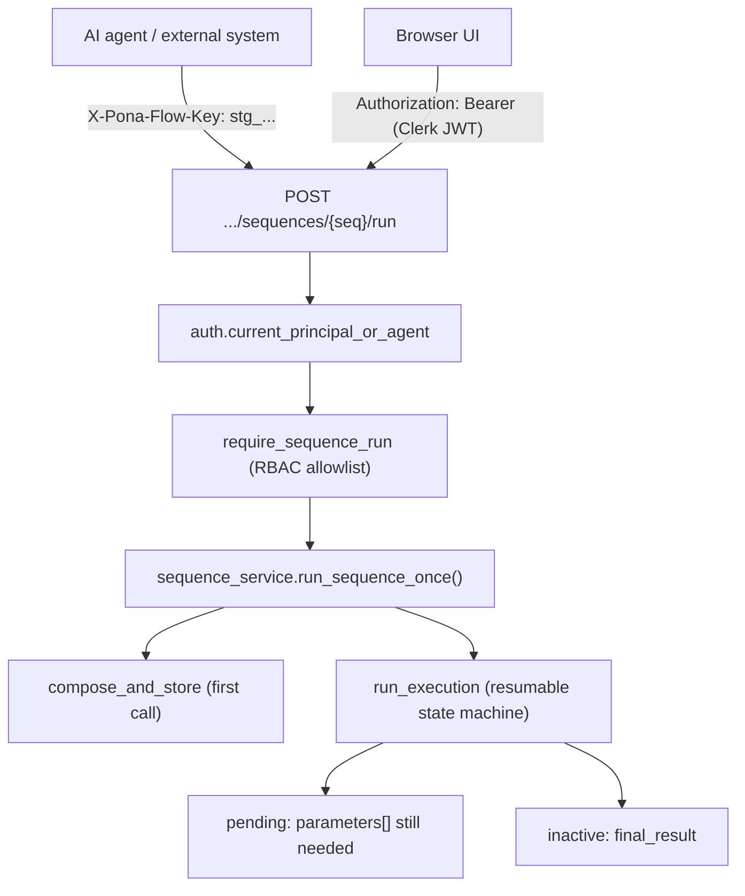
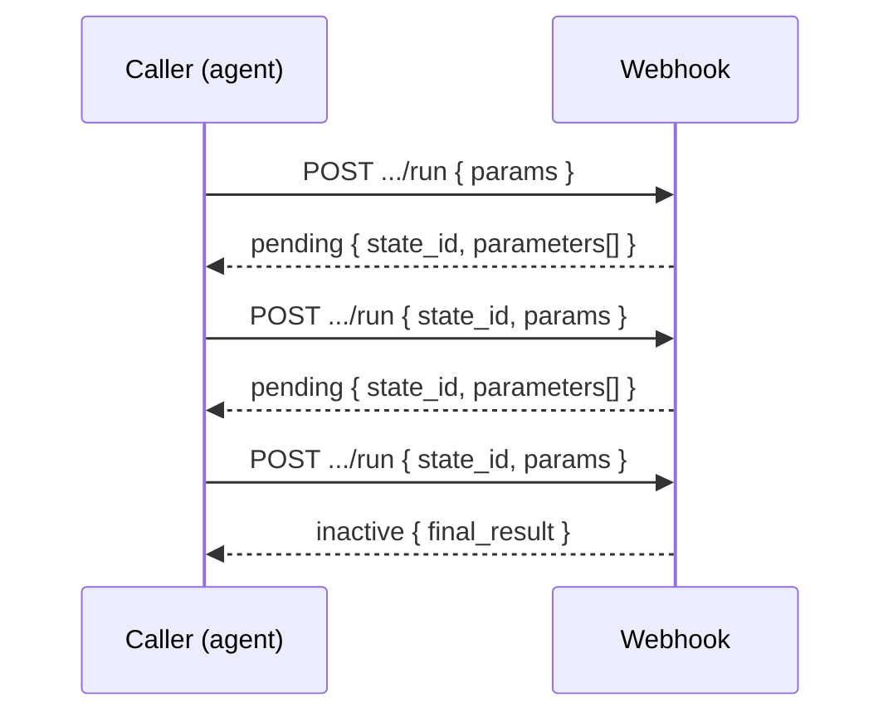

# Sequence Webhooks & Agent Keys — Developer Guide

This guide is for **developers** integrating external systems or AI agents with pona flow.
It covers the inbound **sequence webhook** (run any sequence over HTTP) and the **agent API
keys** that authenticate non-human callers.

For the architectural rationale, see [DECISIONS.md](DECISIONS.md) (D8). For the broader
security model, see [SECURITY-GUIDE.md](SECURITY-GUIDE.md). To have an *external* system fire
sequences from an inbound payload (no agent key, matched/mapped by the event), see the
generic receiver in [EXTERNAL-EVENTS.md](EXTERNAL-EVENTS.md) instead.

> **One-sentence version:** Every triggerable sequence in a space is callable at
> `POST /api/spaces/{space_id}/sequences/{sequence_id}/run`, authenticated by either a
> human's Clerk session or an agent's `stg_` API key, and it returns either the list of
> parameters it still needs (human-in-the-loop) or the final result.

---

## 1. How it fits together



Key ideas:

- A **sequence** is a stored workflow of steps. Some steps require parameters that can only
  come from a caller (the human-in-the-loop case).
- The webhook **composes and runs** a sequence in a single call. If a step needs input the
  caller has not supplied, the run **pauses** and returns the required parameters plus a
  `state_id`. The caller answers by calling again with that `state_id`.
- **Agent keys** map to an `agent` principal that is a member of exactly one space, so the
  same per-sequence permission checks used by the UI apply to agents unchanged.

---

## 2. Setup: mint an agent key

Agent keys are managed by anyone with the **manage space** permission (space owner/admin).
A key is shown **once** at creation — only its SHA-256 hash is stored, so it cannot be
recovered later. If you lose it, revoke it and mint a new one.

### 2.1 Create a key

```bash
curl -X POST "$BASE/api/spaces/$SPACE_ID/agent-keys" \
  -H "Authorization: Bearer $CLERK_JWT" \
  -H "Content-Type: application/json" \
  -d '{ "name": "orders-bot" }'
```

Response (the `token` is your only chance to copy it):

```json
{
  "id": "ID_...",
  "space_id": "MARKETING",
  "principal_id": "ID_...",
  "name": "orders-bot",
  "token": "stg_xKQ...redacted...",
  "role_id": "ID_..."
}
```

By default the key is granted the space's **Member** role (read everything, run any
sequence, no writes). To scope it to specific sequences, pass a `role_id` for a role whose
`sequences` permission lists only the allowed sequence ids:

```bash
curl -X POST "$BASE/api/spaces/$SPACE_ID/agent-keys" \
  -H "Authorization: Bearer $CLERK_JWT" \
  -H "Content-Type: application/json" \
  -d '{ "name": "orders-bot", "role_id": "ID_role_with_limited_sequences" }'
```

Roles are created with `POST /api/space/roles/upsert`; see the permission shape in
[rbac.py](../Engine/server/rbac.py).

### 2.2 List and revoke keys

```bash
# List (metadata only; never returns the token or hash)
curl "$BASE/api/spaces/$SPACE_ID/agent-keys" -H "Authorization: Bearer $CLERK_JWT"

# Revoke (idempotent; the key stops authenticating immediately)
curl -X DELETE "$BASE/api/spaces/$SPACE_ID/agent-keys/$KEY_ID" \
  -H "Authorization: Bearer $CLERK_JWT"
```

---

## 3. Using the webhook

### 3.1 Authenticating

Agents send the key one of two ways (pick one):

```http
X-Pona-Flow-Key: stg_xKQ...
```

or as a Bearer token (useful for clients that only set the standard header):

```http
Authorization: Bearer stg_xKQ...
```

Humans continue to send their Clerk session JWT as `Authorization: Bearer <jwt>`; the same
routes accept both. A token starting with `stg_` is treated as an agent key; anything else
is verified as a Clerk JWT.

### 3.2 Discover what you can run

```bash
curl "$BASE/api/spaces/$SPACE_ID/sequences" -H "X-Pona-Flow-Key: $STG_KEY"
```

Returns only the sequences this principal is permitted to run, each with an aggregated
parameter schema (this is the shape a future MCP server exposes as a tool `inputSchema`):

```json
{
  "space_id": "MARKETING",
  "sequences": [
    {
      "id": "ID_seq_onboard",
      "name": "Onboard customer",
      "group_title": "Customer ops",
      "parameters": [
        { "name": "customer_email", "is_required": true, "value_type": "string" },
        { "name": "plan", "is_required": false, "value_type": "string" }
      ]
    }
  ]
}
```

### 3.3 Run a sequence

```bash
curl -X POST "$BASE/api/spaces/$SPACE_ID/sequences/$SEQUENCE_ID/run" \
  -H "X-Pona-Flow-Key: $STG_KEY" \
  -H "Content-Type: application/json" \
  -d '{ "params": { "customer_email": "[email protected]" } }'
```

The response is one of three shapes (returned verbatim from the executor):

**Needs more input (human-in-the-loop pause):**

```json
{
  "status": "pending",
  "state_id": "ID_state_...",
  "step_id": "ID_step_...",
  "parameters": [
    { "name": "approval_note", "is_required": true, "value_type": "string" }
  ],
  "resolved": { "customer_email": "[email protected]" }
}
```

**Finished:**

```json
{
  "status": "inactive",
  "state_id": "ID_state_...",
  "resolved": { "customer_email": "...", "order_id": "..." },
  "executed": [ { "step_id": "...", "query_id": "...", "endpoint": "" } ],
  "final_result": { "...": "..." }
}
```

**Error:**

```json
{ "status": "error", "message": "state not found" }
```

### 3.4 Resume a paused run

When you get `status: "pending"`, supply the requested parameters and call the **same
endpoint** again, passing back the `state_id`. Do **not** re-send parameters already in
`resolved` — they are remembered.

```bash
curl -X POST "$BASE/api/spaces/$SPACE_ID/sequences/$SEQUENCE_ID/run" \
  -H "X-Pona-Flow-Key: $STG_KEY" \
  -H "Content-Type: application/json" \
  -d '{ "state_id": "ID_state_...", "params": { "approval_note": "Approved by ops" } }'
```

Repeat until you receive `status: "inactive"` (done) or `status: "error"`.



---

## 4. Endpoint reference

| Method & path | Auth | Purpose |
|---------------|------|---------|
| `POST /api/spaces/{space_id}/sequences/{sequence_id}/run` | Clerk **or** agent key | Compose+run a sequence, or resume with `state_id` |
| `GET /api/spaces/{space_id}/sequences` | Clerk **or** agent key | List runnable sequences + parameter schemas |
| `GET /api/spaces/{space_id}/agent-keys` | Clerk, manage-space | List a space's agent keys (metadata only) |
| `POST /api/spaces/{space_id}/agent-keys` | Clerk, manage-space | Mint a key (returns plaintext token once) |
| `DELETE /api/spaces/{space_id}/agent-keys/{key_id}` | Clerk, manage-space | Revoke a key |

Request body for `run`:

| Field | Type | Notes |
|-------|------|-------|
| `params` | object | Parameter name -> value. Empty/`null` values are ignored. |
| `state_id` | string (optional) | Present only when resuming a `pending` run. |

All errors follow the instance-wide contract `{ "error": "<message>" }` with the matching
HTTP status (`400` bad request, `401` invalid/revoked key, `403` not permitted, `500`).

---

## 5. Security notes

- **Keys are hashed at rest.** Only the SHA-256 hash is stored ([agent_keys.py](../Engine/server/agent_keys.py));
  the plaintext is returned once. Verification is constant-time.
- **Least privilege.** Scope a key with a role whose `sequences` permission lists only the
  ids it needs. `require_sequence_run` enforces this on every call.
- **Revocation is immediate.** A revoked key fails verification on its next use; the agent
  principal and its audit history remain intact.
- **Outbound steps are still guarded.** Sequences that call external URLs go through the
  same SSRF controls (`PONA_FLOW_OUTBOUND_ALLOWLIST`, private-range blocking) regardless of
  who triggered the run (see [DECISIONS.md](DECISIONS.md) D7).
- **Edge protections apply.** In production, Cloudflare still fronts the instance for TLS and
  rate limiting (D3) — agent traffic is not exempt.

---

## 6. Local development

The agent-key table is created automatically at startup by the catalog migrations
([migrations.py](../Engine/server/migrations.py)), so no manual database step is needed —
just run the server:

```bash
python Engine/dev_server.py
```

Then mint a key against a space you own (Section 2) and call the webhook (Section 3). For a
quick check without Clerk in front, the run/discovery endpoints accept the `stg_` key
directly via `X-Pona-Flow-Key`.

---

## 7. Relationship to MCP

This webhook layer is the groundwork for serving each space as a Model Context Protocol
server. That gateway is now implemented — see [MCP-GATEWAY.md](MCP-GATEWAY.md). It is a thin
transport wrapper over the same `sequence_service` primitives used here, so the mapping is
nearly one-to-one:

| Webhook concept | MCP concept |
|-----------------|-------------|
| Space | MCP server instance |
| Triggerable sequence | Tool |
| `GET .../sequences` parameter schema | Tool `inputSchema` |
| `pending` + `parameters[]` | Elicitation / "needs input" |
| Agent key + `require_sequence_run` | Tool authorization |

The MCP gateway itself is a commercial feature (see [DECISIONS.md](DECISIONS.md) D1).
