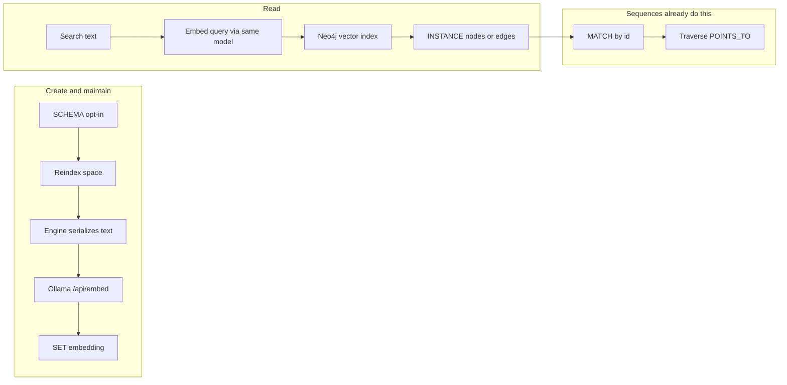
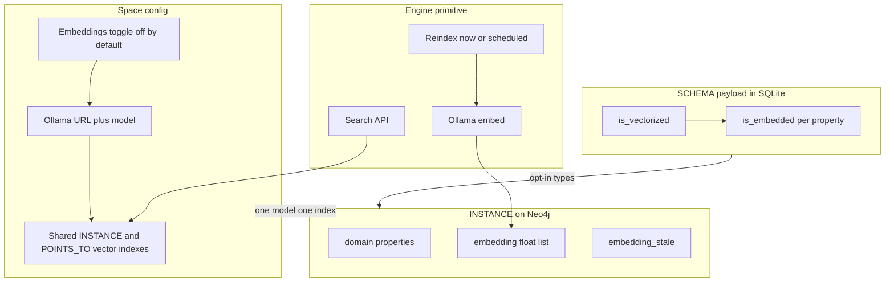

# Vectorization vision
Local semantic find over INSTANCE nodes and relationships. The engine owns a thin
index + search feature: serialize opted-in records, embed them with Ollama, store
the vectors on the graph, and return nearest neighbors. Sequences do the rest
(match those hits, then traverse).

This is an **index and a search API**, not a new authoring surface. It is not a
sidecar vector database, and it is not a user-owned maintenance workflow.

Related reading:

- [VECTORIZATION-SETUP.md](VECTORIZATION-SETUP.md) — step-by-step local setup
  and smoke test (Ollama → space config → SCHEMA opt-in → reindex → search).
- [CONTEXT-GRAPH-DECISIONING.md](CONTEXT-GRAPH-DECISIONING.md) — graphs answer
  “what is connected / which rule applies”; vectors answer “what is similar.”
- [DECISIONS.md](DECISIONS.md) — space isolation, Neo4j-per-space, D7 SSRF
  (HTTP STEPs must not call loopback).
- [FIRST-TIME-SETUP.md](FIRST-TIME-SETUP.md) — local Neo4j Desktop.

---

## 1. Product objective

Three operations, all local:

1. **Create** — turn opted-in INSTANCE nodes and INSTANCE-to-INSTANCE
   `POINTS_TO` edges into vectors.
2. **Maintain** — rebuild those vectors when the records change, or when the
   manager asks.
3. **Read** — given a string, return the nearest graph records. A sequence that
   needs “find similar, then traverse” does: search → IDs → ordinary `MATCH`.

Success metric: **find the right structured record**. Not “answer a question
from notes,” and not “become a document store.”



---

## 2. Why this shape

The first draft tried to make embeddings as configurable as SCHEMAs, STEPs, and
sequences: QUERY-builder toggles, overflow summarization, starter consolidation
sequences the manager could edit, mixed-type search, template export. That is a
different product. The goal above does not need it.

**Stay in Neo4j.** Each space already has its own graph. Neo4j Desktop
`2026.07.0` can hold a vector index on `:INSTANCE` and on `:POINTS_TO`. Hits
*are* the records — no second store and no id-join.

**Do not add a sidecar** (Chroma, Qdrant, LanceDB, sqlite-vec). A second
database is another process, a sync problem, and a per-space collection story
you already have. Ollama is the only extra local process.

**The engine calls Ollama** as a server-side client to `127.0.0.1`.
Authors must not reach Ollama through HTTP STEPs. D7 blocks loopback on
sequence endpoints; punching that hole for “call Chroma” would be worse.

**Maintenance is an engine primitive**, not a sequence the manager reimplements
in Cypher. Sequences cannot read SCHEMA payloads from SQLite, must not `SET`
reserved `embedding`, and cannot call localhost. Cadence can still be a time
event that hits the engine’s reindex endpoint. The *work* is sealed.

---

## 3. Constraints the design must respect

These are facts about the engine today.


| Constraint | Why it matters |
| --- | --- |
| Only three node labels (`STEP`, `SCHEMA`, `INSTANCE`) and one relationship type (`POINTS_TO`) | Neo4j vector indexes are one label + one property + fixed dimensions. All data nodes share `:INSTANCE`; all data edges share `:POINTS_TO`. One node index and one relationship index per space. One embedding model per space. |
| SCHEMA contracts live in SQLite; INSTANCE data lives on Neo4j | Opt-in is schema metadata. The float array is an INSTANCE graph property. |
| `id` is already a reserved schema property name | `embedding` and `embedding_stale` are reserved the same way. |
| Composer emits `RETURN *` on create | A 768–1024 float array on every node will explode graph viz and MCP payloads unless stripped. |
| INSTANCE is graph-only (not mirrored to SQLite `entities`) | Do not start mirroring embeddings into SQLite. |
| HTTP STEPs cannot call loopback (D7) | Ollama is `127.0.0.1:11434`. Only an engine-owned client may call it. |
| Sequences do not read SQLite SCHEMA payloads | Serialization and embed/write of reserved properties cannot be a user STEP. |
| `POINTS_TO` also carries STEP→STEP and SCHEMA→SCHEMA edges | Relationship embeddings and the relationship vector index must match `(:INSTANCE)-[r:POINTS_TO]->(:INSTANCE)` only. |
| Local DBMS reports Neo4j Desktop `version 2026.07.0` | Node and relationship vector indexes are available. Setup docs should still pin a minimum: **Neo4j 2025.01+** (calendar) or **5.18+** on leftover 5.x. |


Rejected alternatives:

- Secondary Neo4j labels per SCHEMA (`:INSTANCE:CUSTOMER`) — breaks the
  three-label ontology.
- Per-schema property names (`embedding_CUSTOMER`) — index explosion.
- Sidecar vector DB — loses “hits are the nodes,” adds sync.
- Per-schema embedding models — dimension mismatch on the shared index.
- User-owned consolidation sequences — cannot legally do the work.
- Cloud embedding providers — out of scope; local Ollama only.

---

## 4. The model

### Space (config panel)

An **Embeddings** section, off by default. Turning it on reveals:

- Ollama URL (default `http://127.0.0.1:11434`). Engine-owned; not a free-text
  SSRF hole — localhost / instance-admin gated, same class of control as D7.
- Embedding model, picked from models Ollama has pulled. No hardcoded name.
  Health check probes `/api/embed` and reads **dimensions** from the response
  (so a chat model picked by mistake fails clearly).
- Cosine similarity (hidden).
- **Reindex space** — runs the engine primitive now.

The vector index is created when the toggle is on, at least one SCHEMA is
opted in, and dimensions are known. Changing the embedding model drop/recreates
the index and requires a reindex (dimensions may have changed). The UI says
that before saving.

Turning the toggle **off** drops the indexes and `REMOVE`s stored `embedding`
values. SCHEMA opt-in flags stay. Confirm before saving.

### SCHEMA (node or relationship)

On the SQLite SCHEMA payload:

- `is_vectorized` boolean — this type is in the index.
- Per-property `is_embedded` boolean — which fields go into the text.

V1 serialization is deterministic and template-free:

- Join `is_embedded` properties in **schema order** as `KEY: value`.
- Skip missing optional properties.
- `checkbox` / `array`: comma-join.
- If the joined text exceeds a conservative **character budget** (derived from
  the model window, not a tokenizer in v1), **truncate**. No generate step, no
  `embedding_summary`, no child `CHUNK` nodes.
- Relationship records: prepend source and target display labels
  (`is_label`), then the edge’s `KEY: value` fields. Endpoint rename marks
  those edges stale (see §5).

When `is_vectorized` is turned on, `is_embedded` defaults to **on** for the
`is_label` property only. Everything else is opt-in. Identifiers, emails, tax
IDs, and booleans stay out unless the author includes them.

A SCHEMA may be saved `is_vectorized` while the space toggle is off; matching
writes land `embedding_stale` until the feature is on and reindex runs.

Do not vectorize STEP or SCHEMA nodes, or workflow/pattern `POINTS_TO` edges.

### INSTANCE (Neo4j)

- Reserved `embedding` (list of floats). Matches Neo4j docs; not `vector`.
- Reserved `embedding_stale` (boolean). Documented system field; ordinary
  READ WHERE may use it (e.g. `embedding_stale = true`).
- Neither is authorable in `schemata[]`. Authors must not SET them from the
  builder. The composer must not put them in user CREATE maps.
- `embedding` is stripped from default graph viz / `RETURN *` unless a query
  explicitly asks for it. `embedding_stale` is not stripped (it is how you
  find not-yet-indexed records).

### Runtime APIs

Not QUERY-builder operations. Two engine routes (names indicative):

- `POST /api/spaces/{id}/embeddings/reindex` — walk opted-in records, embed,
  `SET embedding`, clear stale. Optional filter by `attributive_label`.
- `POST /api/spaces/{id}/embeddings/search` — embed the query text with the
  same model, run `db.index.vector.queryNodes` / `queryRelationships`,
  optional `attributive_label` filter, return records + score.

A time event may call reindex on a schedule. That is cadence only. The
manager does not swap the embed STEP for Cypher.



---

## 5. Create, maintain, read

### Create / maintain

| Event | What happens |
| --- | --- |
| Reindex (button or scheduled) | Engine serializes each opted-in record, calls Ollama, `SET embedding`, clears `embedding_stale`. Truncates over-budget text. |
| INSTANCE create/update of an embedded property, space on, Ollama up, text within budget | **v1.1:** embed inline. **v1:** may only set `embedding_stale` and wait for reindex — inline is an optimization, not the contract. |
| Same write, Ollama down, space off, or dimensions unknown | Graph write succeeds; `embedding_stale = true`. Never fail create/update because of embeddings. |
| INSTANCE update of a non-embedded property | No-op for embeddings. |
| Endpoint `is_label` change on a node | Mark that node’s INSTANCE `POINTS_TO` edges stale if those relationship schemas are vectorized (relationship text includes endpoint labels). |
| SCHEMA include-list change, or `is_vectorized` turned on | Mark matching instances stale; reindex (or inline, later) refills. |
| Space changes embedding model | Drop/recreate the index; mark every vectorized record stale; reindex refills. |
| Last `is_vectorized` turned off, or space toggle off | Drop the index; `REMOVE` leftover `embedding` values. Toggle-off keeps SCHEMA flags and sets `embedding_stale` so a later toggle-on + reindex has a queue. |

Reindex is O(stale or opted-in records). A model change is O(every vectorized
instance) and also recreates the index. Those are different jobs; do not hide
a model change inside “catch-up.”

Overlapping reindex requests **coalesce**: do not run two at once; enqueue at
most one follow-up. This is engine/scheduler behavior, not a user sequence.

### Read

`POST .../embeddings/search`:

- Query text (literal in the request body).
- `k` (engine default 10).
- Optional `attributive_label`. **Default: required / on.** Mixed-type search
  across the shared `:INSTANCE` index is an advanced opt-in; cosine across
  `CUSTOMER` and `NOTE` in one index is usually noise.
- If filtering by label after `queryNodes`, **overfetch** then filter so k
  results of the requested type remain possible.
- Returns records + score. Score is a result field, not a reserved graph
  property.

If Ollama is down at query time, the search **fails** with a clear error.
Writes can degrade to stale; a similarity query cannot.

Ordinary graph READ may still `WHERE embedding_stale = true` to list
not-yet-indexed records. No special builder checkbox.

v1 does **not** walk `POINTS_TO` from the hits in the same call. Find, then
traverse, is a two-step sequence — that is the complementary half of the
context graph, and sequences already do it.

---

## 6. What this is not (v1)

- Not a general RAG / document-chunk engine
- Not a sidecar vector database
- Not per-schema embedding models
- Not vectorization of STEP or SCHEMA nodes (or their `POINTS_TO` edges)
- Not authorable `embedding` fields on the SCHEMA form
- Not a user-owned consolidation sequence the manager reimplements
- Not embed templates (join `KEY: value` in schema order)
- Not overflow summarization / `embedding_summary` / generate-on-embed
- Not a following `POINTS_TO` hop on the search call
- Not hybrid keyword + vector ranking
- Not cloud embedding providers

---

## 7. Settled decisions

### 7.1 Where vectors live

Neo4j, on the records they describe. One `:INSTANCE` vector index and one
INSTANCE-to-INSTANCE `:POINTS_TO` vector index per space.

### 7.2 Who calls Ollama

The engine, via a server-side localhost client. Not HTTP STEPs, not
a user sequence.

### 7.3 How you search

Two front doors onto the same engine primitive.

The **engine search API** (`POST /api/spaces/{id}/embeddings/search`) returns scalar
hits — id, label, score. Sequences consume those ids and traverse.

The **QUERY builder** offers a `vector_search` toggle on READ INSTANCE. It is not a new
operation type: the composer emits ordinary Cypher that calls the vector index, and the
engine fills the embedding before the statement runs.

```cypher
CALL db.index.vector.queryNodes($vector_index, $vector_overfetch, $vector_query) YIELD node AS PROJECT, score
WHERE PROJECT.attributive_label = 'PROJECT' AND (PROJECT.STATUS = 'active')
RETURN PROJECT, score
ORDER BY score DESC
LIMIT $vector_k
```

Returning the node itself (rather than scalar projections) is what lets the results
panel render both the graph and table views. Because the statement is ordinary stored
Cypher, a vector-search operation saves to the catalog and runs inside a sequence like
any other read.

Two parameter tiers:

- Author-facing, declared on the catalog row so a sequence step can override them:
  `vector_query_text`, `vector_k`. This is what makes "search text from an upstream
  step" work.
- Engine-filled, never sent by the client: `vector_query` (the embedding),
  `vector_index`, `vector_overfetch`.

An author can name the first tier themselves by typing exactly `$searchTerm` or
`$topK` into the text or k field, which turns it into an ordinary declared parameter.
That is what lets two vector searches coexist in one sequence — under the reserved
names they would both read the same `vector_query_text`. The composer tags the
resulting catalog row `vector_role: "text" | "k"` so the resolver knows which value to
embed, falling back to the reserved names when no row carries the marker (which is
every operation saved before this existed). A parameterized `k` renders as
`LIMIT $topK`; a literal one keeps `LIMIT $vector_k`. The text never reaches Cypher
either way.

The resolver (`embeddings.resolve_search_params`) runs on both execution paths and
no-ops unless a statement calls `db.index.vector.query*`, so ordinary reads pay nothing.

A `all_labels` toggle (off by default) drops the label filter entirely, searching every
vectorized type at once — the shared `:INSTANCE` index already spans all of them. It is
compose-time only, since it changes the statement shape rather than a bound value. Note
that a broad search names no SCHEMA in its Cypher, so it is not counted as a reference
to one by delete blast radius or template export.

Scope: a single INSTANCE node with no relationship hops, and (unless `all_labels` is on)
a literal `attributive_label`. Per-node WHERE filters are kept and render after the
index call as a post-filter —
which means a tight filter can return fewer than `k` hits, because the filter applies to
the overfetched candidate set rather than the whole label. RETURN projections, ORDER BY,
SKIP/LIMIT and DISTINCT are hidden while the toggle is on: `k` is the limit and score is
the order.

### 7.4 How you maintain

Engine reindex primitive + **Reindex space** button. Optional time event
that calls the same endpoint. Inline embed on write is v1.1.

### 7.5 Write failure policy

Succeed the INSTANCE write and set `embedding_stale`. Do not fail
create/update because Ollama is down.

### 7.6 Property include

Per-property `is_embedded`. Default on for `is_label` only; everything else
is opt-in.

### 7.7 Overflow

Truncate to a character budget. One `embedding` per record. No generate, no
summary property, no CHUNK nodes.

### 7.8 Property names

`embedding` and `embedding_stale`. Reserved. `embedding` stripped from
default viz / `RETURN *`.

### 7.9 Label filter

Search defaults to one `attributive_label`. Mixed types are opt-in — via `kind` /
omitted label on the API, or the **Search all types** toggle in the builder.
Overfetch when post-filtering.

### 7.10 Space toggle

Off by default. Off after use is destructive to stored vectors, not to
SCHEMA opt-in flags.

### 7.11 Relationship embeddings

In v1. Local Neo4j `2026.07.0` supports relationship vector indexes.
Endpoint display-label changes stale those edges.

### 7.12 Neo4j version pin

Known local version: Desktop `2026.07.0`. Setup docs pin **Neo4j 2025.01+**
(or 5.18+ on leftover 5.x).

---

## 8. Later (not v1)

- Inline embed on the write path when text fits and Ollama is up
- Embed templates (`{{NAME}} is a {{TITLE}}`)
- Relationship-kind vector search in the QUERY builder (the API already supports it)
- Following hop from hits in the same read
- Hybrid keyword + vector ranking
- Child `CHUNK` INSTANCE pattern (a SCHEMA convention, not engine magic)
- Hosted Ollama / non-localhost embedders (that is a deployment decision;
  v1 is local-dev)

---

## 9. Implementation touchpoints

Not a task list — a map of where this would land.


| Area | Paths |
| --- | --- |
| Space config UI | `App/ui/src/components/space/SpaceConfigPanel.tsx` |
| Space record / API | `Engine/server/spaces.py`, `Engine/server/routes/spaces.py` |
| Schema flags + validation | `App/authoring/src/schemaRules.ts`, `App/connector/src/types.ts`, `Engine/server/schema_update.py` |
| Reserved property names | `App/authoring/src/schemaRules.ts` (`isReservedSchemaPropertyKey`) |
| Ollama client + reindex/search | new engine module (engine-owned localhost client) + space routes |
| Write-path stale marker (v1) / inline embed (v1.1) | `Engine/server/packages.py`, `Engine/server/routes/execution.py` |
| Currency pattern to follow (not overload) | `Engine/server/schema_currency.py` — including INSTANCE-only `POINTS_TO` match |
| Scheduled reindex | `Engine/server/scheduler.py` calling the reindex endpoint |
| Vector index DDL | `Engine/server/schema_update.py` (`_apply_index_changes` as the btree analogue) |
| Graph result stripping | `Engine/server/graph.py` |
| QUERY-builder toggle | `App/ui/src/components/builder/VectorSearchSection.tsx`, `App/composer/src/render/vectorSearch.ts` |
| Execution pre-step | `Engine/server/embeddings.py` (`resolve_search_params`), `Engine/server/packages.py`, `Engine/server/execution_run.py` |
| Setup docs | `Docs/FIRST-TIME-SETUP.md` (Neo4j 2025.01+ / 5.18+; Ollama optional) |


Tests, when added, belong in `/tests` per project convention.

A useful first slice, before SCHEMA payloads or space-config UI: one admin
reindex of a single label, one search route, prove the loop. Promote opt-in
and the panel only after that is useful.
